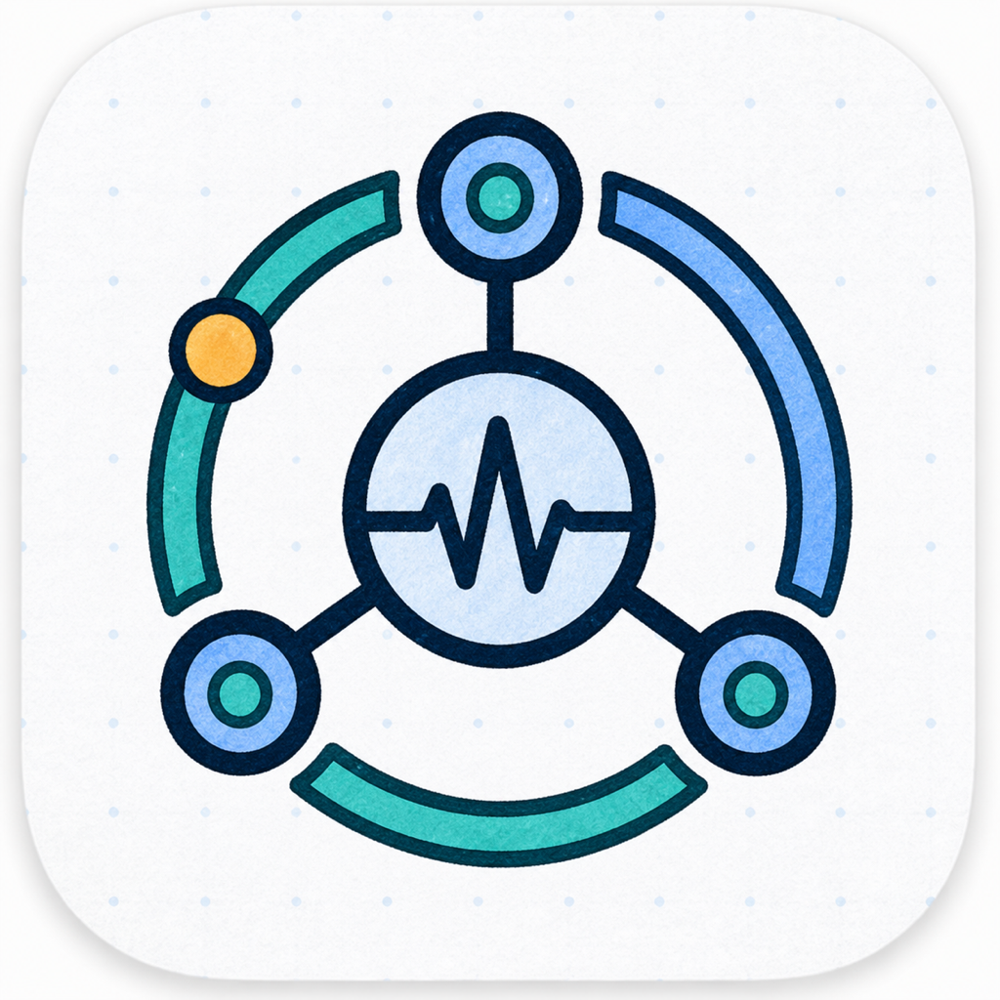

<p align="center">
  <a href="./README.md">English</a> | <strong>中文</strong>
</p>

<p align="center">
  
</p>

<h1 align="center">OPL Fleet Agent</h1>

<p align="center"><strong>在菜单栏或系统托盘中，安静地查看本机 Codex Token 吞吐</strong></p>
<p align="center">macOS 菜单栏 · Windows 系统托盘 · Ambient Ops Gateway 协同</p>

<p align="center">
  <a href="https://github.com/gaofeng21cn/opl-fleet-agent/actions/workflows/ci.yml"></a>
  <a href="https://github.com/gaofeng21cn/opl-fleet-agent/releases/latest"></a>
  <a href="LICENSE"></a>
  
</p>


<table>
  <tr>
    <td width="33%" valign="top">
      <strong>主要用途</strong><br/>
      查看最近一段时间内 Codex 已完成请求对应的 Token 吞吐、请求频率和活跃会话
    </td>
    <td width="33%" valign="top">
      <strong>桌面入口</strong><br/>
      macOS 菜单栏应用与 Windows 11 原生系统托盘应用
    </td>
    <td width="33%" valign="top">
      <strong>隐私边界</strong><br/>
      默认只读取本机统计事件，不需要 API Key，也不上传对话正文
    </td>
  </tr>
</table>

> OPL Fleet Agent 是运行观察工具，不是账单系统。它展示本机 Codex 日志中可见的用量，不能证明具体由哪个 API Key 计费，也不等同于服务端账单。

## 给用户

### 这是什么

OPL Fleet Agent 是一个本机优先的桌面小工具。它增量读取 Codex 已经写入
`sessions` 目录的 Token 用量事件，把最近一段时间的吞吐显示在 macOS 菜单栏
或 Windows 系统托盘中。

它不会启动或代理 Codex，也不会改变模型请求。它只是把原本分散在会话日志里的
统计信息整理成一个随时可见的本机仪表盘。

### 它能显示什么

- 最近 `1 分钟 / 5 分钟 / 30 分钟 / 1 小时` 的 Token 每秒吞吐
- 输入、缓存输入、输出和推理 Token 分项
- 每分钟请求数、活跃会话数和缓存占比
- `5 秒 / 15 秒 / 30 秒 / 1 分钟` 自动刷新
- 菜单栏统计区间记忆、手动刷新、会话目录快捷入口和登录时启动
- 自动检查 GitHub 发布版本，并在用户确认后执行校验过的更新
- 面向脚本和自动化的 JSON 快照命令
- 可选的 Ambient Ops 局域网发现与汇总指标上报

Codex 通常在一次模型请求完成后才写入用量，因此这里显示的是“完成时吞吐”，
不是按流式输出分片实时变化的瞬时速度。

### macOS 安装

系统要求为 macOS 13 Ventura 或更高版本。应用本身不需要 API Key。

一键安装最新正式版：

```bash
curl -fsSL https://raw.githubusercontent.com/gaofeng21cn/opl-fleet-agent/main/scripts/install-release.sh | bash
```

使用 Homebrew：

```bash
brew install --cask gaofeng21cn/codex-tps/codex-tps
```

Homebrew Tap 和 `Codex-TPS.dmg` 发布文件名保留兼容名称，以保证老版本的安装与
应用内更新命令继续可用。

也可以从[最新发布版本](https://github.com/gaofeng21cn/opl-fleet-agent/releases/latest)
下载 `Codex-TPS.dmg`，打开后拖入“应用程序”。

正式版同时支持 Apple Silicon 和 Intel Mac，使用 Apple Developer ID 签名并
经过公证。安装脚本会校验发布的 SHA-256、暂存并验证新应用，再替换已有版本；
替换失败时会恢复原应用。

默认安装到 `/Applications` 并启动。也可以安装到当前用户目录且不立即启动：

```bash
curl -fsSL https://raw.githubusercontent.com/gaofeng21cn/opl-fleet-agent/main/scripts/install-release.sh | \
  CODEX_TPS_INSTALL_DIR="$HOME/Applications" CODEX_TPS_NO_LAUNCH=1 bash
```

### Windows 安装

Windows 版是基于 .NET 8 WinForms 的 Windows 11 原生系统托盘应用。标准安装器
是自包含的，不需要额外安装 .NET 运行时。

从[最新发布版本](https://github.com/gaofeng21cn/opl-fleet-agent/releases/latest)下载：

- `OPL-Fleet-Agent-Windows-win-x64-Setup.exe`
- `OPL-Fleet-Agent-Windows-win-x64-Setup.exe.sha256`

新安装会写入 `%LOCALAPPDATA%\Programs\OPL Fleet Agent`；升级时保留 Windows AppId、
设置和旧版更新兼容链，同时迁移旧快捷方式、开机启动项和主程序文件名。当前安装器尚未使用
Authenticode 签名，因此 Windows 可能显示未知发布者
或 SmartScreen 提示；发布页、SHA-256 和持续集成记录可以证明仓库来源，但不能替代
Windows 代码签名信任。

完整校验、便携版安装、WSL 目录选择和当前验证边界见
[`windows/README.md`](windows/README.md)。

### 数据从哪里来

默认目录：

- macOS：`~/.codex/sessions`
- Windows：`%USERPROFILE%\.codex\sessions`

如果 Codex 数据目录不在默认位置，可通过 `CODEX_HOME` 指定。Windows 版也支持可访问的
WSL UNC 路径，例如 `\\wsl.localhost\Ubuntu\home\<user>\.codex`。

### 统计口径

| 指标 | 含义 |
| --- | --- |
| `Token/s` | 选定时间窗内已完成请求的 `total_tokens`，除以完整时间窗长度 |
| 输入 | 输入 Token，包含缓存输入子集 |
| 缓存 | 缓存输入 Token，单独展示但不会重复加总 |
| 输出 | 输出 Token，包含推理输出子集 |
| 推理 | 推理输出 Token，单独展示但不会重复加总 |
| 请求/分钟 | 选定窗口内完成请求的频率 |
| 活跃会话 | 最近仍有用量事件的会话数量 |

### 与 Ambient Ops 协同

[Ambient Ops](https://github.com/gaofeng21cn/opl-fleet-cockpit) 用于把多台电脑上的 Codex
汇总指标和局域网网络状态集中显示在浏览器或 Android 常驻屏上。

macOS 版 OPL Fleet Agent 会继续发布兼容服务名 `_codex-tps._tcp.local` 和只读本机状态端点，Ambient
Ops 无需单独部署 Gateway 即可显示这台 Mac。Direct 只提供汇总 TPS、活跃会话数、
主机 CPU、网络吞吐以及所选 Pet 资源；Windows 本版尚未发布 Direct 服务。

舰队模式下，Agent 可通过 `_ambient-ops._tcp.local` 自动发现 Gateway。首次连接
时，桌面应用会在本机生成独立设备密钥并打开批准页；用户核对六位配对码后，应用
开始发送签名快照，不需要复制共享令牌。

macOS 私钥保存在 Keychain，Windows 私钥只以当前用户 DPAPI 密文保存。Ambient
Ops 仅保存对应公钥。上报内容只包括：

- 稳定机器标识、机器名和平台
- 采集时间与采集状态
- 最近 `1 分钟 / 5 分钟` 的汇总 Token 计数
- 活跃会话数
- 可选宠物定义与活动状态

可选的 `oplFleet` 扩展使用 `opl_fleet_agent_telemetry.v1` schema，声明
`local`、`direct`、`fleet` 三种模式，以及本机观测、doctor、执行约束和脱敏回执
能力。Agent 不拥有 registry、policy、admission、lease 或 dispatch 权威；这些仍由
OPL Flow、私人 OPL Fleet Controller 和批准的 Instance 管理。Gateway 只做遥测接收、
聚合和只读投影，不形成第二套调度权威。上报不会包含接口名、地址、凭据、原始日志、
会话标识、路径、提示词、回复正文或工具内容。该集成默认关闭，可在应用设置中随时
停用、重新发现或改用手动 HTTP(S) 地址。

### 隐私边界

- 只解析统计和去重所需的结构化事件，不读取或展示对话正文。
- 网络访问用于检查和下载 GitHub 发布版本；macOS 还会在局域网广播只含汇总数据的
  Direct 服务。
- 启用 Ambient Ops 后，只在用户选择的局域网服务端上报允许清单内的汇总指标。
- 没有分析 SDK、账户系统或云端会话同步。
- 本机日志格式属于实现依赖；未来 Codex 版本变化可能需要更新解析器。

## 面向 Agent

### 安装与配置原则

Agent 应优先安装已发布、已校验的正式版，而不是把本地构建当作用户安装结果。

macOS 正式版：

```bash
curl -fsSL https://raw.githubusercontent.com/gaofeng21cn/opl-fleet-agent/main/scripts/install-release.sh | bash
```

macOS 从源码安装：

```bash
git clone https://github.com/gaofeng21cn/opl-fleet-agent.git
cd opl-fleet-agent
./scripts/install.sh
```

源码安装会为当前 Mac 构建、临时签名、安装并启动应用；它不等同于 Developer ID
签名、公证和正式发布版本。需要自定义目录时使用 `CODEX_TPS_INSTALL_DIR`，不立即
启动时传入 `--no-launch`。

Windows 应优先使用最新发布版本中的标准安装器，并在打开前校验同名
`.sha256` 文件。不要把未签名安装器描述为已获得 Authenticode 信任。

### 配置非默认 Codex 数据目录

先验证目标目录确实包含 `sessions`，再设置 `CODEX_HOME`。不要自动在多个目录之间
猜测或合并，也不要改动 Codex 自身的执行环境。

```bash
CODEX_HOME=/path/to/codex-home swift run codex-tps-snapshot --json
```

Windows 原生目录与 WSL UNC 目录是不同的数据来源，必须由用户明确选择。

### 配置 Ambient Ops

桌面应用优先使用图形界面中的自动发现和一次性批准流程。Agent 可以打开设置、
触发重新发现并引导用户核对配对码，但不得代替用户批准未知设备，也不得读取或
导出设备私钥。

无界面 Agent 在未设置 `CODEX_TPS_AMBIENT_URL` 时同样可以自动发现服务。需要固定
实例时设置 `CODEX_TPS_AMBIENT_INSTANCE_ID`；显式地址始终覆盖自动发现。

旧版或无界面共享令牌路径：

```bash
CODEX_TPS_AMBIENT_URL=http://ambient-ops.local:8787 \
CODEX_TPS_AMBIENT_TOKEN='<agent-token>' \
CODEX_TPS_MACHINE_ID=primary-mac \
CODEX_TPS_MACHINE_NAME='Primary Mac' \
swift run codex-tps-agent --once
```

不要把真实令牌写进任务描述、仓库、日志或长期 shell 历史。macOS 可通过
`CODEX_TPS_AMBIENT_TOKEN_KEYCHAIN_SERVICE` 和可选的
`CODEX_TPS_KEYCHAIN_ACCOUNT` 从通用密码 Keychain 项读取令牌。

### Agent 验收

```bash
swift test
swift run codex-tps-snapshot --json
```

Windows 核心测试：

```powershell
dotnet test windows/tests/CodexTPS.Core.Tests -c Release
```

完成安装时还应回读：

- 实际安装路径和应用版本
- macOS 签名、公证与 Gatekeeper 状态，或 Windows 安装文件版本
- 目标 `CODEX_HOME/sessions` 是否被正确读取
- 面板刷新后是否出现真实统计
- 启用 Ambient Ops 时，批准状态和服务端接受的机器身份是否一致

测试通过、本地构建成功或发现了发布版本，都不等于已经完成安装与运行验收。

### 不可破坏的实现边界

- 不持久化、记录、传输或渲染提示词与回复正文。
- `total_tokens` 是吞吐总量；缓存输入与推理输出是子集，不能重复相加。
- 保留跨文件去重和分叉会话重放逻辑，避免同一请求被重复统计。
- Ambient Ops 只能接收允许清单内的聚合字段。
- 发布仍需经过仓库既有的签名、公证、校验和安装后回读流程。

## 文档与开发

- [统计与架构](docs/architecture.md)
- [Windows 原生版](windows/README.md)
- [Ambient Ops](https://github.com/gaofeng21cn/opl-fleet-cockpit)
- [项目 Agent 合同](AGENTS.md)

```bash
xcrun swift-format lint --recursive Sources Tests Package.swift
swift test
swift run codex-tps-snapshot --json
./scripts/build-app.sh
./scripts/build-dmg.sh
```

项目采用 [MIT License](LICENSE)。统计口径参考了公开的
[Tokscale](https://github.com/junhoyeo/tokscale) 项目，但 OPL Fleet Agent 是独立实现，
不包含 Tokscale 代码。

OPL Fleet Agent 是非官方社区项目，与 OpenAI 不存在隶属、赞助或背书关系。
