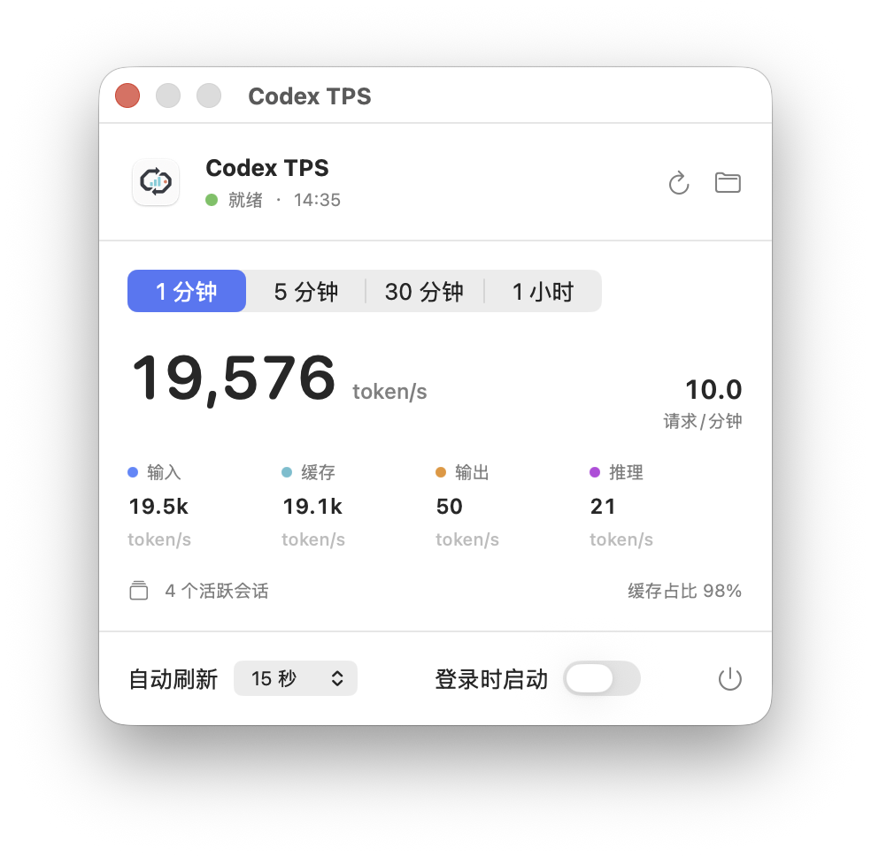

<p align="center">
  <a href="./README.md">English</a> | <strong>中文</strong>
</p>

<p align="center">
  
</p>

<h1 align="center">OPL Fleet Agent</h1>

<p align="center"><strong>在菜单栏或系统托盘中，安静地查看本机 Codex Token 吞吐</strong></p>
<p align="center">macOS 菜单栏 · Windows 系统托盘 · OPL Fleet Gateway 协同</p>

<p align="center">
  <a href="https://github.com/gaofeng21cn/opl-fleet-agent/actions/workflows/ci.yml"></a>
  <a href="https://github.com/gaofeng21cn/opl-fleet-agent/releases/latest"></a>
  <a href="LICENSE"></a>
  
</p>



<table>
  <tr>
    <td width="33%" valign="top">
      <strong>主要用途</strong><br/>
      查看最近一段时间内 Codex 已完成请求对应的 Token 吞吐、请求频率和活跃会话
    </td>
    <td width="33%" valign="top">
      <strong>桌面入口</strong><br/>
      macOS 菜单栏应用与 Windows 11 原生系统托盘应用
    </td>
    <td width="33%" valign="top">
      <strong>隐私边界</strong><br/>
      默认只读取本机统计事件，不需要 API Key，也不上传对话正文
    </td>
  </tr>
</table>

> OPL Fleet Agent 是运行观察工具，不是账单系统。它展示本机 Codex 日志中可见的用量，不能证明具体由哪个 API Key 计费，也不等同于服务端账单。

## 给用户

### 这是什么

OPL Fleet Agent 是一个本机优先的桌面小工具。它增量读取 Codex 已经写入
`sessions` 目录的 Token 用量事件，把最近一段时间的吞吐显示在 macOS 菜单栏
或 Windows 系统托盘中。

它不会启动或代理 Codex，也不会改变模型请求。它只是把原本分散在会话日志里的
统计信息整理成一个随时可见的本机仪表盘。

### 它能显示什么

- 最近 `1 分钟 / 5 分钟 / 30 分钟 / 1 小时` 的 Token 每秒吞吐
- 输入、缓存输入、输出和推理 Token 分项
- 每分钟请求数、活跃会话数和缓存占比
- 可配置刷新频率（macOS 为 `5 秒 / 15 秒 / 30 秒 / 1 分钟`）
- 菜单栏统计区间记忆、手动刷新、会话目录快捷入口和登录时启动
- 自动检查 GitHub 发布版本，并在用户确认后执行校验过的更新
- 面向脚本和自动化的 JSON 快照命令
- macOS 的 Direct 局域网发现，以及可选的 OPL Fleet Gateway 汇总指标上报

Codex 通常在一次模型请求完成后才写入用量，因此这里显示的是“完成时吞吐”，
不是按流式输出分片实时变化的瞬时速度。

### macOS 安装

系统要求为 macOS 13 Ventura 或更高版本。应用本身不需要 API Key。

通过统一的 OPL Homebrew Tap 安装：

```bash
brew tap gaofeng21cn/one-person-lab
brew install --cask opl-fleet-agent
```

也可以直接运行正式版安装脚本：

```bash
curl -fsSL https://raw.githubusercontent.com/gaofeng21cn/opl-fleet-agent/main/scripts/install-release.sh | bash
```

也可以从[最新发布版本](https://github.com/gaofeng21cn/opl-fleet-agent/releases/latest)
下载 `OPL-Fleet-Agent.dmg`，打开后拖入“应用程序”。

正式版同时支持 Apple Silicon 和 Intel Mac，使用 Apple Developer ID 签名并
经过公证。安装脚本会校验发布的 SHA-256、暂存并验证新应用，再替换已有版本；
替换失败时会恢复原应用。

默认安装到 `/Applications` 并启动。也可以安装到当前用户目录且不立即启动：

```bash
curl -fsSL https://raw.githubusercontent.com/gaofeng21cn/opl-fleet-agent/main/scripts/install-release.sh | \
  OPL_FLEET_AGENT_INSTALL_DIR="$HOME/Applications" OPL_FLEET_AGENT_NO_LAUNCH=1 bash
```

### Windows 安装

Windows 版是基于 .NET 8 WinForms 的 Windows 11 原生系统托盘应用。标准安装器
是自包含的，不需要额外安装 .NET 运行时。

从[最新发布版本](https://github.com/gaofeng21cn/opl-fleet-agent/releases/latest)下载：

- `OPL-Fleet-Agent-Windows-win-x64-Setup.exe`
- `OPL-Fleet-Agent-Windows-win-x64-Setup.exe.sha256`

安装会写入 `%LOCALAPPDATA%\Programs\OPL Fleet Agent`，主程序为 `OPLFleetAgent.exe`；
当前安装器尚未使用 Authenticode 签名，因此 Windows 可能显示未知发布者
或 SmartScreen 提示；发布页、SHA-256 和持续集成记录可以证明仓库来源，但不能替代
Windows 代码签名信任。

完整校验、便携版安装、WSL 目录选择和当前验证边界见
[`windows/README.md`](windows/README.md)。

### 数据从哪里来

默认目录：

- macOS：`~/.codex/sessions`
- Windows：`%USERPROFILE%\.codex\sessions`

如果 Codex 数据目录不在默认位置，可通过 `CODEX_HOME` 指定。Windows 版也支持可访问的
WSL UNC 路径，例如 `\\wsl.localhost\Ubuntu\home\<user>\.codex`。

### 统计口径

| 指标 | 含义 |
| --- | --- |
| `Token/s` | 选定时间窗内已完成请求的 `total_tokens`，除以完整时间窗长度 |
| 输入 | 输入 Token，包含缓存输入子集 |
| 缓存 | 缓存输入 Token，单独展示但不会重复加总 |
| 输出 | 输出 Token，包含推理输出子集 |
| 推理 | 推理输出 Token，单独展示但不会重复加总 |
| 请求/分钟 | 选定窗口内完成请求的频率 |
| 活跃会话 | 最近两分钟修改过的会话文件数，包括尚未完成的请求 |

### 与 OPL Fleet Gateway 协同

[OPL Fleet Gateway](https://github.com/gaofeng21cn/opl-fleet-cockpit) 用于把多台电脑上的 Codex
汇总指标和局域网网络状态集中显示在浏览器或 Android 常驻屏上。

macOS 版 OPL Fleet Agent 会发布既有协议服务名 `_opl-fleet-agent._tcp.local` 和只读本机状态端点，
使 OPL Fleet Cockpit 无需启用 Gateway 推送即可显示这台 Mac。Direct 只提供汇总 TPS、
活跃会话数、主机 CPU、网络吞吐以及所选 Pet 资源；Windows 本版尚未发布 Direct 服务。

舰队模式下，Agent 可通过 `_ambient-ops._tcp.local` 自动发现 Gateway。首次连接
时，桌面应用会在本机生成独立设备密钥并打开批准页；用户核对六位配对码后，应用
开始发送签名快照，不需要复制共享令牌。

macOS 私钥保存在 Keychain，Windows 私钥只以当前用户 DPAPI 密文保存。OPL Fleet Gateway
仅保存对应公钥。上报内容包括：

- 稳定机器标识、机器名和平台
- 采集时间与采集状态
- 最近 `1 分钟 / 5 分钟` 的汇总 Token 计数
- 活跃会话数
- 可选宠物定义与活动状态

上报还可包含可用的 CPU 和网络汇总观测。会话标识、本地路径、网络接口身份、
地址、提示词、回复正文、凭据、原始日志和工具内容均不在上报字段中。两个桌面版本默认启用 Gateway 发现，
签名上报需要先批准设备；可在设置中停用或配置。手工连接见 [Agent 运维](docs/operations.md)，
协议和只读权威边界见[架构](docs/architecture.md)。

### 隐私边界

- 只解析统计和去重所需的结构化事件；扫描器读取日志字节，但不解码、保留或展示对话正文。
- 网络访问用于检查和下载 GitHub 发布版本；macOS 还会在局域网广播只含汇总数据的
  Direct 服务。
- 启用 OPL Fleet Gateway 后，只在用户选择的局域网服务端上报允许清单内的汇总指标。
- 没有分析 SDK、账户系统或云端会话同步。
- 本机日志格式属于实现依赖；未来 Codex 版本变化可能需要更新解析器。

## 文档导航

- [Agent 运维](docs/operations.md)：配置、无界面上报与安装后验收
- [架构](docs/architecture.md)：采集、统计口径、隐私与 Package 边界
- [开发](docs/development.md)：构建、测试与发布验证
- [Windows 安装](windows/README.md)：标准安装器、便携包与 WSL
- [贡献者规则](AGENTS.md)：编辑约束与文档生命周期

项目采用 [Apache License 2.0](LICENSE)。统计口径参考了公开的
[Tokscale](https://github.com/junhoyeo/tokscale) 项目，但 OPL Fleet Agent 是独立实现，
不包含 Tokscale 代码。

OPL Fleet Agent 是非官方社区项目，与 OpenAI 不存在隶属、赞助或背书关系。
